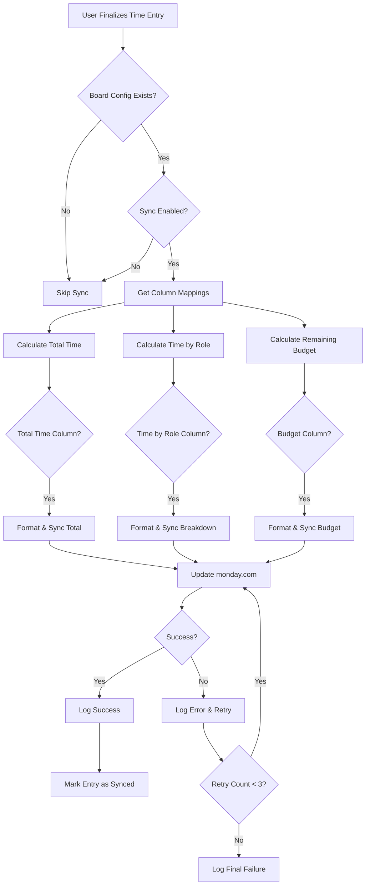

# Monday.com Column Sync Feature - Enhanced Specification

## Overview

This feature enables automatic synchronization of tracked time data to monday.com board columns, with support for role-based tracking, budget calculations, and flexible configuration per board.

## Feature Requirements

### 1. Role-Based Time Tracking

- **Display tracked time broken down by role** (e.g., Developer: 5h, Designer: 3h)
- **Support for role-specific hourly rates** for budget calculations
- **Global role definitions** with board-specific overrides
- **Multiple display options**: popup tooltip, separate columns, or combined text column

### 2. Budget Tracking

- **Calculate remaining budget** based on:
  - Total time tracked across all roles
  - Role-specific hourly rates
  - Budget value from linked monday.com column
- **Real-time budget updates** when time entries are finalized
- **Support for budget column types**: Numbers, Formula, or Mirror columns

### 3. Configuration Flexibility

- **Global settings**: Default roles and rates
- **Board-specific settings**: Override roles/rates per board
- **Column mapping per board**: Choose which columns to sync
- **Multiple sync targets**: Total time, time-by-role, remaining budget

## Database Schema Design

### Enhanced Schema

```sql
-- ============================================
-- Role Management with Hourly Rates
-- ============================================

-- Extend existing role table with hourly rate
ALTER TABLE public.role 
ADD COLUMN hourly_rate DECIMAL(10,2) DEFAULT 0.00,
ADD COLUMN is_active BOOLEAN DEFAULT TRUE,
ADD COLUMN color_hex VARCHAR(7); -- For UI display

COMMENT ON COLUMN public.role.hourly_rate IS 'Default hourly rate in currency units';
COMMENT ON COLUMN public.role.color_hex IS 'Hex color code for role display (e.g., #FF5733)';

-- ============================================
-- Board-Specific Configuration
-- ============================================

CREATE TABLE public.board_config (
    id UUID PRIMARY KEY DEFAULT gen_random_uuid(),
    board_id TEXT NOT NULL UNIQUE,
    board_name TEXT NOT NULL,
    sync_enabled BOOLEAN DEFAULT TRUE,
    
    -- Budget settings
    budget_column_id TEXT, -- monday.com column ID for budget
    budget_column_type TEXT, -- 'numbers', 'formula', 'mirror'
    currency_symbol VARCHAR(5) DEFAULT '€',
    
    -- Sync settings
    sync_on_finalize BOOLEAN DEFAULT TRUE,
    sync_total_time BOOLEAN DEFAULT TRUE,
    sync_time_by_role BOOLEAN DEFAULT TRUE,
    sync_remaining_budget BOOLEAN DEFAULT TRUE,
    
    created_at TIMESTAMPTZ NOT NULL DEFAULT NOW(),
    updated_at TIMESTAMPTZ NOT NULL DEFAULT NOW()
);

CREATE INDEX idx_board_config_board_id ON public.board_config(board_id);

COMMENT ON TABLE public.board_config IS 'Board-level configuration for time tracking and syncing';

-- ============================================
-- Board-Specific Role Overrides
-- ============================================

CREATE TABLE public.board_role_override (
    id UUID PRIMARY KEY DEFAULT gen_random_uuid(),
    board_id TEXT NOT NULL REFERENCES public.board_config(board_id) ON DELETE CASCADE,
    role_id UUID NOT NULL REFERENCES public.role(id) ON DELETE CASCADE,
    hourly_rate DECIMAL(10,2) NOT NULL,
    is_enabled BOOLEAN DEFAULT TRUE,
    created_at TIMESTAMPTZ NOT NULL DEFAULT NOW(),
    updated_at TIMESTAMPTZ NOT NULL DEFAULT NOW(),
    UNIQUE(board_id, role_id)
);

CREATE INDEX idx_board_role_override_board ON public.board_role_override(board_id);
CREATE INDEX idx_board_role_override_role ON public.board_role_override(role_id);

COMMENT ON TABLE public.board_role_override IS 'Board-specific hourly rate overrides for roles';

-- ============================================
-- Column Sync Configuration
-- ============================================

CREATE TABLE public.column_sync_config (
    id UUID PRIMARY KEY DEFAULT gen_random_uuid(),
    board_id TEXT NOT NULL REFERENCES public.board_config(board_id) ON DELETE CASCADE,
    
    -- Column identification
    column_id TEXT NOT NULL,
    column_name TEXT NOT NULL,
    column_type TEXT NOT NULL, -- 'numbers', 'text', 'long_text', 'time_tracking'
    
    -- Sync purpose
    sync_purpose TEXT NOT NULL, -- 'total_time', 'time_by_role', 'remaining_budget'
    
    -- Format settings
    time_format TEXT DEFAULT 'hours', -- 'hours', 'seconds', 'hh:mm'
    include_breakdown BOOLEAN DEFAULT FALSE, -- For time_by_role
    
    sync_enabled BOOLEAN DEFAULT TRUE,
    last_synced_at TIMESTAMPTZ,
    
    created_at TIMESTAMPTZ NOT NULL DEFAULT NOW(),
    updated_at TIMESTAMPTZ NOT NULL DEFAULT NOW(),
    
    UNIQUE(board_id, column_id)
);

CREATE INDEX idx_column_sync_board ON public.column_sync_config(board_id);
CREATE INDEX idx_column_sync_purpose ON public.column_sync_config(sync_purpose);

COMMENT ON TABLE public.column_sync_config IS 'Maps monday.com columns to sync purposes (total time, time by role, budget)';

-- ============================================
-- Sync History & Audit Log
-- ============================================

CREATE TABLE public.sync_log (
    id UUID PRIMARY KEY DEFAULT gen_random_uuid(),
    board_id TEXT NOT NULL,
    item_id TEXT NOT NULL,
    column_id TEXT NOT NULL,
    sync_purpose TEXT NOT NULL,
    
    -- Sync details
    value_synced TEXT NOT NULL, -- JSON representation of synced value
    success BOOLEAN NOT NULL,
    error_message TEXT,
    
    -- Metadata
    triggered_by UUID REFERENCES public.user_profiles(id),
    time_entry_id UUID REFERENCES public.time_entry(id),
    
    created_at TIMESTAMPTZ NOT NULL DEFAULT NOW()
);

CREATE INDEX idx_sync_log_board_item ON public.sync_log(board_id, item_id);
CREATE INDEX idx_sync_log_created ON public.sync_log(created_at DESC);

COMMENT ON TABLE public.sync_log IS 'Audit log of all column sync operations';
```

## Implementation Architecture

### Data Flow Diagram



### Component Architecture

```typescript
// lib/monday/columnSync.ts - Core sync service
interface ColumnSyncService {
  syncItemColumns(itemId: string, boardId: string, userId: string): Promise<SyncResult>
  calculateTotalTime(itemId: string, userId: string): Promise<number>
  calculateTimeByRole(itemId: string, userId: string): Promise<RoleTimeBreakdown>
  calculateRemainingBudget(itemId: string, boardId: string, userId: string): Promise<number>
}

// lib/monday/columnFormatters.ts - Value formatting
interface ColumnFormatter {
  formatTotalTime(seconds: number, format: 'hours' | 'seconds' | 'hh:mm'): string
  formatTimeByRole(breakdown: RoleTimeBreakdown, includeRates: boolean): string
  formatBudget(remaining: number, currency: string): string
}

// lib/database/boardConfig.ts - Configuration management
interface BoardConfigService {
  getBoardConfig(boardId: string): Promise<BoardConfig>
  getColumnMappings(boardId: string): Promise<ColumnMapping[]>
  getRoleRate(boardId: string, roleId: string): Promise<number>
}
```

## API Endpoints

### 1. Configuration Endpoints

```typescript
// GET /api/boards/:boardId/config
// Get board configuration including column mappings
{
  boardId: string,
  syncEnabled: boolean,
  columnMappings: [
    {
      columnId: string,
      columnName: string,
      syncPurpose: 'total_time' | 'time_by_role' | 'remaining_budget',
      format: string
    }
  ],
  roles: [
    {
      roleId: string,
      roleName: string,
      hourlyRate: number,
      color: string
    }
  ]
}

// POST /api/boards/:boardId/config
// Update board configuration

// GET /api/boards/:boardId/columns
// Fetch available columns from monday.com for mapping
```

### 2. Sync Endpoints

```typescript
// POST /api/sync/item/:itemId
// Manually trigger sync for a specific item

// POST /api/sync/board/:boardId
// Bulk sync all items on a board

// GET /api/sync/status/:itemId
// Check sync status and history for an item
```

### 3. Role Management

```typescript
// GET /api/roles
// List all roles

// POST /api/roles
// Create new role

// PUT /api/roles/:roleId
// Update role (including hourly rate)

// POST /api/boards/:boardId/roles/:roleId/override
// Set board-specific rate override
```

## Column Value Formats

### 1. Total Time Column (Numbers)

```typescript
// Format: Total seconds as number
{
  columnId: "numbers1",
  value: JSON.stringify(18000) // 5 hours = 18000 seconds
}
```

### 2. Time by Role Column (Text/Long Text)

```typescript
// Format: Formatted text with breakdown
{
  columnId: "text1",
  value: JSON.stringify("Developer: 5h 30m\nDesigner: 2h 15m\nTotal: 7h 45m")
}

// Alternative: JSON format for parsing
{
  columnId: "long_text1",
  value: JSON.stringify({
    breakdown: [
      { role: "Developer", seconds: 19800, formatted: "5h 30m" },
      { role: "Designer", seconds: 8100, formatted: "2h 15m" }
    ],
    total: { seconds: 27900, formatted: "7h 45m" }
  })
}
```

### 3. Remaining Budget Column (Numbers)

```typescript
// Calculation: Budget - (Σ(time_per_role * rate_per_role))
// Example:
// Budget: €5000
// Developer: 10h @ €80/h = €800
// Designer: 5h @ €60/h = €300
// Remaining: €5000 - €1100 = €3900

{
  columnId: "numbers2",
  value: JSON.stringify(3900)
}
```

## Configuration UI Design

### Settings Page Structure

```
┌─────────────────────────────────────────────┐
│  Settings > Time Tracking Configuration    │
├─────────────────────────────────────────────┤
│                                             │
│  🎭 Global Roles                           │
│  ┌─────────────────────────────────────┐  │
│  │ Developer      €80/h    [Edit]      │  │
│  │ Designer       €60/h    [Edit]      │  │
│  │ Project Mgr    €90/h    [Edit]      │  │
│  │                                      │  │
│  │ [+ Add New Role]                    │  │
│  └─────────────────────────────────────┘  │
│                                             │
│  📊 Board Configurations                   │
│  ┌─────────────────────────────────────┐  │
│  │ Select Board: [Dropdown ▼]          │  │
│  │                                      │  │
│  │ ☑ Enable sync for this board        │  │
│  │                                      │  │
│  │ Column Mappings:                     │  │
│  │ • Total Time: [Column Dropdown ▼]   │  │
│  │ • Time by Role: [Column Dropdown ▼] │  │
│  │ • Budget: [Column Dropdown ▼]       │  │
│  │ • Remaining: [Column Dropdown ▼]    │  │
│  │                                      │  │
│  │ Role Rate Overrides:                 │  │
│  │ • Developer: [€80/h ▼] (global)     │  │
│  │ • Designer: [€75/h ▼] (override)    │  │
│  │                                      │  │
│  │ [Save Configuration]                 │  │
│  └─────────────────────────────────────┘  │
│                                             │
└─────────────────────────────────────────────┘
```

## Advanced Features

### 1. Time by Role Display Options

**Option A: Tooltip/Popup (Recommended)**

- Display total time in column
- Show role breakdown on hover/click
- Requires custom monday.com app column type

**Option B: Text Column**

- Formatted text with line breaks
- Immediately visible
- Limited formatting options

**Option C: Separate Columns per Role**

- One column per role
- Clean, structured data
- Requires more columns

### 2. Budget Calculation Logic

```typescript
interface BudgetCalculation {
  budgetAmount: number;        // From monday.com column
  totalCost: number;           // Calculated from time × rates
  remainingBudget: number;     // Budget - Total Cost
  utilizationPercent: number;  // (Total Cost / Budget) × 100
  breakdown: {
    role: string;
    hours: number;
    rate: number;
    cost: number;
  }[];
}

// Example calculation
function calculateBudget(
  itemId: string,
  boardId: string
): BudgetCalculation {
  // 1. Get budget from monday column
  const budget = getBudgetFromColumn(itemId, boardId);
  
  // 2. Get all time entries for item
  const entries = getTimeEntriesForItem(itemId);
  
  // 3. Group by role and calculate costs
  const breakdown = entries.reduce((acc, entry) => {
    const rate = getRoleRate(boardId, entry.role);
    const hours = entry.duration / 3600;
    const cost = hours * rate;
    
    acc[entry.role] = {
      role: entry.role_name,
      hours: (acc[entry.role]?.hours || 0) + hours,
      rate: rate,
      cost: (acc[entry.role]?.cost || 0) + cost
    };
    
    return acc;
  }, {});
  
  // 4. Calculate totals
  const totalCost = Object.values(breakdown)
    .reduce((sum, item) => sum + item.cost, 0);
  
  return {
    budgetAmount: budget,
    totalCost,
    remainingBudget: budget - totalCost,
    utilizationPercent: (totalCost / budget) * 100,
    breakdown: Object.values(breakdown)
  };
}
```

### 3. Sync Strategies

**Strategy 1: Immediate Sync (Default)**

- Sync when time entry is finalized
- Real-time updates
- Higher API usage

**Strategy 2: Batched Sync**

- Sync every N minutes
- Reduce API calls
- Slight delay in updates

**Strategy 3: Manual Sync**

- User triggers sync
- Full control
- Requires user action

## Error Handling & Edge Cases

### 1. Missing Column

```typescript
if (!columnExists) {
  log.warning(`Column ${columnId} not found on board ${boardId}`);
  // Options:
  // - Disable sync for that column
  // - Notify admin
  // - Auto-remove from config
}
```

### 2. Permission Errors

```typescript
if (error.status === 403) {
  // App lacks boards:write permission
  log.error('Insufficient permissions for column update');
  // Notify user to re-authenticate app
}
```

### 3. Rate Limiting

```typescript
if (error.status === 429) {
  const retryAfter = error.headers['retry-after'];
  await exponentialBackoff(retryAfter);
  // Retry with backoff: 1s, 2s, 4s, 8s
}
```

### 4. Multiple Users

```typescript
// Option 1: Track time per user separately
// Option 2: Aggregate all users (requires careful consideration)
// Option 3: Board setting to choose behavior

const config = getBoardConfig(boardId);
if (config.aggregateMultipleUsers) {
  totalTime = getAllUsersTime(itemId);
} else {
  totalTime = getCurrentUserTime(itemId, userId);
}
```

### 5. Deleted/Archived Items

```typescript
try {
  await updateColumn(boardId, itemId, value);
} catch (error) {
  if (error.message.includes('Item not found')) {
    log.info(`Item ${itemId} deleted, skipping sync`);
    // Mark time entry as orphaned
    await markTimeEntryOrphaned(timeEntryId);
  }
}
```

## Required API Permissions

Current permissions:

```typescript
approvedScopes: [
  "me:read",
  "boards:read",
  "docs:read",
  "workspaces:read",
  "users:read",
  "account:read",
  "updates:read",
  "assets:read",
  "tags:read",
  "teams:read",
  "webhooks:read"
]
```

**Required additions:**

```typescript
requiredScopes: [
  ...currentScopes,
  "boards:write"  // Required for change_column_value mutation
]
```

## Testing Strategy

### Unit Tests

- Column value formatting functions
- Budget calculation logic
- Role rate resolution (global vs override)
- Time aggregation by role

### Integration Tests

- End-to-end sync flow
- Error handling and retries
- Multiple column type compatibility
- Board config CRUD operations

### Manual Testing Checklist

- [ ] Create role with hourly rate
- [ ] Configure board with column mappings
- [ ] Track time with different roles
- [ ] Verify total time syncs correctly
- [ ] Verify role breakdown format
- [ ] Verify budget calculation
- [ ] Test with missing columns
- [ ] Test with insufficient permissions
- [ ] Test board-specific rate overrides
- [ ] Test manual sync trigger
- [ ] Test bulk board sync

## Performance Considerations

### Optimization Strategies

1. **Batch Updates**
   - Group multiple column updates into single API call
   - Reduce API complexity score

2. **Caching**
   - Cache board configs (5 min TTL)
   - Cache role rates (10 min TTL)
   - Cache column metadata (15 min TTL)

3. **Async Processing**
   - Queue sync operations
   - Process in background
   - Don't block user actions

4. **Incremental Sync**
   - Only sync changed items
   - Track last_synced_at timestamp
   - Compare with time_entry.updated_at

## Rollout Plan

### Phase 1: Core Infrastructure

1. Database migrations
2. Basic sync service
3. Total time column sync only

### Phase 2: Role-Based Tracking

1. Role rate configuration
2. Time by role calculation
3. Role breakdown formatting

### Phase 3: Budget Features

1. Budget column integration
2. Remaining budget calculation
3. Cost breakdown by role

### Phase 4: UI & Configuration

1. Settings page for roles
2. Board configuration UI
3. Column mapping interface

### Phase 5: Advanced Features

1. Manual/bulk sync
2. Sync history/audit log
3. Error recovery & notifications

## Summary

This enhanced specification addresses all your requirements:

1. ✅ **Role-based time tracking** with breakdown display
2. ✅ **Budget calculations** with remaining budget sync
3. ✅ **Flexible configuration** (global + board-specific)
4. ✅ **Multiple column types** supported
5. ✅ **Scalable architecture** with proper error handling
6. ✅ **Audit trail** for compliance and debugging

The implementation follows monday.com best practices and integrates seamlessly with your existing time tracking system.
