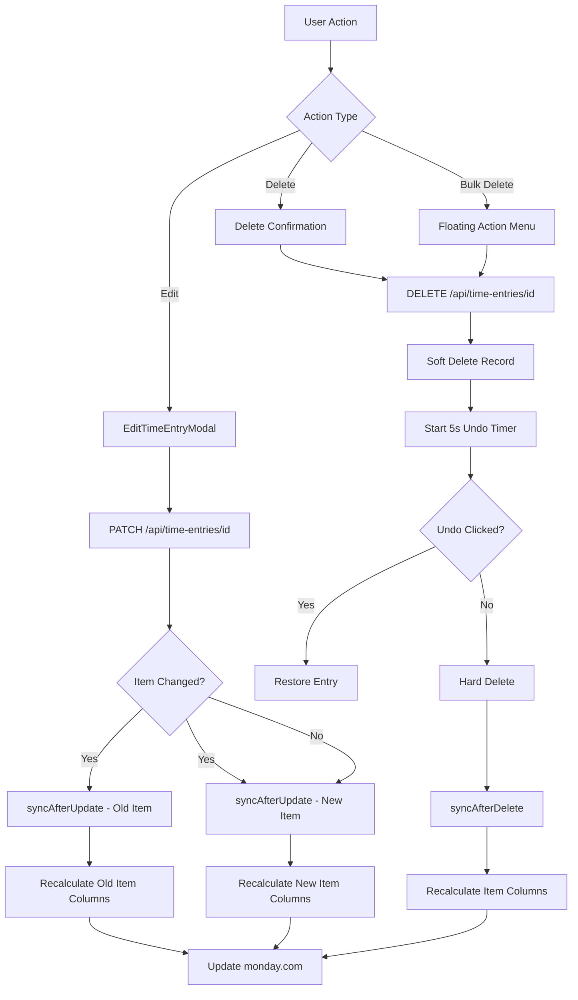

# Time Entry Update & Delete with monday.com Column Sync

## Overview

This document outlines the implementation plan for adding update and delete functionality to time entries, with automatic synchronization to monday.com board columns.

## Current State Analysis

### Existing Sync Implementation

Currently, time entries sync to monday.com columns in two scenarios:

1. **On Finalize** (`/api/time-entries/finalize`) - When a draft time entry is finalized
2. **On Manual Entry** (`/api/time-entries/manual`) - When a manual time entry is created

Both use the [`syncAfterFinalize()`](../lib/columnSync.ts:590) function which:

- Checks if sync is enabled for the board
- Calls [`syncItemColumns()`](../lib/columnSync.ts) to update all configured columns for an item
- Supports three sync purposes:
  - `total_time`: Sum of all time entries for an item
  - `time_by_role`: Breakdown of time by role
  - `remaining_budget`: Budget minus actual cost

### Gap Identification

**Missing functionality:**

- ✗ No UPDATE endpoint for time entries
- ✗ No DELETE endpoint for time entries
- ✗ No sync triggered when time entry is modified
- ✗ No sync triggered when time entry is deleted
- ✗ No UI for editing existing time entries
- ✗ No UI for deleting time entries
- ✗ No handling for item/board changes (old item needs sync too)

## Requirements

Based on user feedback:

1. **Edit Functionality**: Users can edit ALL fields except `user_id`
2. **Item Change Handling**: Sync BOTH old and new items when item/board changes
3. **UI Pattern**:
   - Three-dot menu in each table row for individual actions
   - Floating action buttons for bulk operations (bottom center)
4. **Delete Behavior**:
   - Confirmation dialog before delete
   - Soft-delete with 5-second undo option

## Technical Design

### Architecture Overview



### Database Schema Changes

**Add soft-delete support to `time_entry` table:**

```sql
-- Migration: 011_add_soft_delete_to_time_entry.sql
ALTER TABLE time_entry 
ADD COLUMN deleted_at TIMESTAMP WITH TIME ZONE DEFAULT NULL,
ADD COLUMN deleted_by VARCHAR(255) DEFAULT NULL;

-- Index for filtering out deleted entries
CREATE INDEX idx_time_entry_deleted_at ON time_entry(deleted_at) 
WHERE deleted_at IS NOT NULL;
```

### API Endpoints

#### 1. PATCH `/api/time-entries/[id]/route.ts`

**Purpose**: Update an existing time entry

**Request Body**:

```typescript
interface UpdateTimeEntryRequest {
  taskName?: string;
  comment?: string;
  boardId?: string;
  boardName?: string;
  itemId?: string;
  itemName?: string;
  parentItemId?: string;
  parentItemName?: string;
  roleId?: string;
  roleName?: string;
  duration?: number; // in seconds
  startTime?: string; // ISO string
  endTime?: string; // ISO string
}
```

**Response**:

```typescript
{
  success: true;
  data: TimeEntry;
  syncResults?: {
    oldItem?: ItemSyncResult;
    newItem?: ItemSyncResult;
  };
}
```

**Flow**:

1. Authenticate user via monday context
2. Fetch existing time entry
3. Verify user owns the time entry
4. Detect if item/board changed (for dual-sync)
5. Update time entry in database
6. Invalidate cache
7. Trigger column sync (background):
   - If item changed: sync old item first, then new item
   - If item same: sync current item only
8. Return updated entry

#### 2. DELETE `/api/time-entries/[id]/route.ts`

**Purpose**: Soft-delete a time entry with undo option

**Request Body**:

```typescript
interface DeleteTimeEntryRequest {
  permanent?: boolean; // true for hard delete, false/undefined for soft
}
```

**Response**:

```typescript
{
  success: true;
  deleted: boolean;
  undoToken?: string; // JWT token for undo within 5 seconds
  message: string;
}
```

**Flow (Soft Delete)**:

1. Authenticate user
2. Fetch time entry
3. Verify ownership
4. Mark as deleted (set `deleted_at`, `deleted_by`)
5. Generate undo token (expires in 5 seconds)
6. Invalidate cache
7. Return success with undo token
8. Background: Wait 5 seconds, then:
   - Check if entry still marked deleted
   - If yes: hard delete and trigger sync
   - If no: do nothing (was undone)

**Flow (Hard Delete via Undo Expiry)**:

1. Permanently delete from database
2. Invalidate cache
3. Trigger column sync for the item

#### 3. POST `/api/time-entries/[id]/undo`

**Purpose**: Restore a soft-deleted time entry

**Request Body**:

```typescript
interface UndoDeleteRequest {
  undoToken: string;
}
```

**Response**:

```typescript
{
  success: true;
  restored: TimeEntry;
}
```

**Flow**:

1. Verify undo token (JWT, 5s expiry)
2. Fetch time entry by ID
3. Verify still soft-deleted (`deleted_at` is set)
4. Clear `deleted_at` and `deleted_by`
5. Invalidate cache
6. Return restored entry

### Column Sync Functions

#### `syncAfterUpdate()` in [`lib/columnSync.ts`](../lib/columnSync.ts)

```typescript
/**
 * Sync columns after a time entry is updated
 * Handles both old and new items when item assignment changes
 */
export async function syncAfterUpdate(
  newEntry: TimeEntry,
  oldEntry: TimeEntry,
  userId: string
): Promise<{
  oldItemSync?: ItemSyncResult | null;
  newItemSync?: ItemSyncResult | null;
}> {
  const results: any = {};
  
  // Check if item/board changed
  const itemChanged = 
    oldEntry.item_id !== newEntry.item_id || 
    oldEntry.board_id !== newEntry.board_id;
  
  if (itemChanged && oldEntry.item_id && oldEntry.board_id) {
    // Sync old item (time was removed from it)
    console.log(`[ColumnSync] Item changed - syncing old item ${oldEntry.item_id}`);
    results.oldItemSync = await syncItemColumns(
      oldEntry.item_id,
      oldEntry.board_id,
      userId,
      oldEntry.id
    );
  }
  
  // Always sync new/current item
  if (newEntry.item_id && newEntry.board_id) {
    console.log(`[ColumnSync] Syncing updated item ${newEntry.item_id}`);
    results.newItemSync = await syncItemColumns(
      newEntry.item_id,
      newEntry.board_id,
      userId,
      newEntry.id
    );
  }
  
  return results;
}
```

#### `syncAfterDelete()` in [`lib/columnSync.ts`](../lib/columnSync.ts)

```typescript
/**
 * Sync columns after a time entry is deleted
 * Recalculates totals for the item the entry was associated with
 */
export async function syncAfterDelete(
  deletedEntry: TimeEntry,
  userId: string
): Promise<ItemSyncResult | null> {
  if (!deletedEntry.item_id || !deletedEntry.board_id) {
    console.log(`[ColumnSync] No item/board for deleted entry ${deletedEntry.id}`);
    return null;
  }
  
  console.log(
    `[ColumnSync] Syncing after delete for item ${deletedEntry.item_id}`
  );
  
  return await syncItemColumns(
    deletedEntry.item_id,
    deletedEntry.board_id,
    userId,
    deletedEntry.id
  );
}
```

### Database Helper Functions

Add to [`lib/database.ts`](../lib/database.ts):

```typescript
/**
 * Update a time entry by ID
 */
export async function updateTimeEntry(
  id: string,
  updates: TimeEntryUpdate,
  userId: string
): Promise<{ old: TimeEntry; new: TimeEntry }> {
  // Fetch old entry first
  const oldEntry = await getTimeEntryById(id);
  if (!oldEntry) {
    throw new Error(`Time entry ${id} not found`);
  }
  
  // Verify ownership
  if (oldEntry.user_id !== userId) {
    throw new Error('Unauthorized to update this time entry');
  }
  
  // Update entry
  const { data, error } = await supabaseAdmin
    .from('time_entry')
    .update({
      ...updates,
      updated_at: new Date().toISOString(),
    })
    .eq('id', id)
    .select()
    .single();
    
  if (error) {
    console.error(`Error updating time entry ${id}:`, error);
    throw error;
  }
  
  // Invalidate cache
  await cacheHelper.del(`${CACHE_PREFIX}${id}`);
  await cacheHelper.clearPattern(`${CACHE_PREFIX}*`);
  
  return { old: oldEntry, new: data };
}

/**
 * Soft-delete a time entry
 */
export async function softDeleteTimeEntry(
  id: string,
  userId: string
): Promise<TimeEntry> {
  const entry = await getTimeEntryById(id);
  if (!entry) {
    throw new Error(`Time entry ${id} not found`);
  }
  
  if (entry.user_id !== userId) {
    throw new Error('Unauthorized to delete this time entry');
  }
  
  const { data, error } = await supabaseAdmin
    .from('time_entry')
    .update({
      deleted_at: new Date().toISOString(),
      deleted_by: userId,
    })
    .eq('id', id)
    .select()
    .single();
    
  if (error) {
    throw error;
  }
  
  // Invalidate cache
  await cacheHelper.del(`${CACHE_PREFIX}${id}`);
  await cacheHelper.clearPattern(`${CACHE_PREFIX}*`);
  
  return data;
}

/**
 * Restore a soft-deleted time entry
 */
export async function restoreTimeEntry(
  id: string,
  userId: string
): Promise<TimeEntry> {
  const { data, error } = await supabaseAdmin
    .from('time_entry')
    .update({
      deleted_at: null,
      deleted_by: null,
    })
    .eq('id', id)
    .eq('user_id', userId)
    .select()
    .single();
    
  if (error) {
    throw error;
  }
  
  // Invalidate cache
  await cacheHelper.del(`${CACHE_PREFIX}${id}`);
  await cacheHelper.clearPattern(`${CACHE_PREFIX}*`);
  
  return data;
}

/**
 * Permanently delete a time entry
 */
export async function hardDeleteTimeEntry(
  id: string,
  userId: string
): Promise<TimeEntry> {
  const entry = await getTimeEntryById(id);
  if (!entry) {
    throw new Error(`Time entry ${id} not found`);
  }
  
  if (entry.user_id !== userId) {
    throw new Error('Unauthorized to delete this time entry');
  }
  
  const { error } = await supabaseAdmin
    .from('time_entry')
    .delete()
    .eq('id', id);
    
  if (error) {
    throw error;
  }
  
  // Invalidate cache
  await cacheHelper.del(`${CACHE_PREFIX}${id}`);
  await cacheHelper.clearPattern(`${CACHE_PREFIX}*`);
  
  return entry;
}
```

### Frontend Components

#### 1. **EditTimeEntryModal**

Extend or duplicate [`SaveTimerModal`](../components/dashboard/SaveTimerModal.tsx) to support editing:

```typescript
interface EditTimeEntryModalProps {
  show: boolean;
  onClose: () => void;
  entry: TimeEntry; // The entry being edited
  onSaved: () => void;
}
```

**Key differences from SaveTimerModal**:

- Pre-populate all fields from existing entry
- Call PATCH endpoint instead of finalize
- Include entry ID in API call
- Show "Update" instead of "Save" button

#### 2. **TimeEntryRowMenu**

Three-dot menu component for individual row actions:

```typescript
interface TimeEntryRowMenuProps {
  entry: TimeEntry;
  onEdit: (entry: TimeEntry) => void;
  onDelete: (entry: TimeEntry) => void;
}
```

**Actions**:

- Edit (pencil icon) → Opens EditTimeEntryModal
- Delete (trash icon) → Shows confirmation, then soft-deletes

#### 3. **BulkActionButtons**

Floating button group for bulk operations:

```typescript
interface BulkActionButtonsProps {
  selectedIds: string[];
  onBulkDelete: (ids: string[]) => void;
  onClearSelection: () => void;
}
```

**Position**: Fixed, bottom-center of screen  
**Actions**:

- Delete Selected (X items)
- Cancel Selection

#### 4. **DeleteConfirmationDialog**

Simple Mantine Modal for delete confirmation:

```typescript
interface DeleteConfirmationDialogProps {
  show: boolean;
  onConfirm: () => void;
  onCancel: () => void;
  count: number; // Number of entries being deleted
}
```

#### 5. **UndoToast**

Enhanced toast notification with undo button:

```typescript
// Shown after deletion
showToast(
  `${count} entry deleted`,
  'warning',
  5000, // 5 second duration
  {
    actionLabel: 'Undo',
    onAction: handleUndo,
  }
);
```

### Updated [`TimeEntriesTable`](../components/dashboard/TimeEntriesTable.tsx)

**Changes**:

1. Add state for edit modal
2. Add three-dot menu to each row
3. Add floating action buttons when items selected
4. Handle edit action
5. Handle delete action (soft-delete + undo)
6. Handle bulk delete

**Key Functions**:

```typescript
const handleEdit = (entry: TimeEntry) => {
  setEditingEntry(entry);
  setShowEditModal(true);
};

const handleDelete = async (entry: TimeEntry) => {
  const confirmed = await showDeleteConfirmation(1);
  if (!confirmed) return;
  
  // Soft delete
  const response = await fetch(`/api/time-entries/${entry.id}`, {
    method: 'DELETE',
  });
  
  const { undoToken } = await response.json();
  
  // Show undo toast
  showToast('Entry deleted', 'warning', 5000, {
    actionLabel: 'Undo',
    onAction: () => handleUndo(entry.id, undoToken),
  });
  
  // Refresh list
  refetch();
};

const handleUndo = async (id: string, token: string) => {
  await fetch(`/api/time-entries/${id}/undo`, {
    method: 'POST',
    body: JSON.stringify({ undoToken: token }),
  });
  
  refetch();
  showToast('Entry restored', 'positive', 2000);
};
```

## Implementation Sequence

### Phase 1: Backend Foundation

1. ✅ Create migration for soft-delete columns
2. ✅ Add database helper functions (update, soft-delete, restore, hard-delete)
3. ✅ Add `syncAfterUpdate()` to columnSync.ts
4. ✅ Add `syncAfterDelete()` to columnSync.ts

### Phase 2: API Endpoints

5. ✅ Implement PATCH `/api/time-entries/[id]/route.ts`
6. ✅ Implement DELETE `/api/time-entries/[id]/route.ts`
7. ✅ Implement POST `/api/time-entries/[id]/undo`

### Phase 3: UI Components

8. ✅ Create EditTimeEntryModal component
9. ✅ Create TimeEntryRowMenu component
10. ✅ Create BulkActionButtons component
11. ✅ Create DeleteConfirmationDialog component
12. ✅ Enhance ToastProvider to support action buttons

### Phase 4: Integration

13. ✅ Update TimeEntriesTable with all new components
14. ✅ Wire up edit functionality
15. ✅ Wire up delete with undo
16. ✅ Wire up bulk delete

### Phase 5: Testing & Documentation

17. ✅ Test update → sync flow
18. ✅ Test delete → sync flow
19. ✅ Test undo functionality
20. ✅ Test bulk operations
21. ✅ Update documentation

## Edge Cases & Considerations

### 1. **Concurrent Updates**

- **Issue**: Two users edit same entry simultaneously
- **Solution**: Use optimistic locking with `updated_at` timestamp comparison
- **Behavior**: Last write wins, show conflict warning

### 2. **Undo After Page Refresh**

- **Issue**: User deletes, refreshes page, can't undo
- **Solution**: Undo tokens expire in 5s anyway, this is acceptable
- **Alternative**: Store pending deletes in localStorage (complex)

### 3. **Sync Failure on Update/Delete**

- **Issue**: monday.com API fails during sync
- **Solution**: Log to `sync_history` table, allow retry
- **Behavior**: Entry updated/deleted but columns not synced (shows in admin)

### 4. **Editing While Timer Running**

- **Issue**: User edits a draft while timer is active
- **Solution**: Prevent editing draft entries, only finalized ones
- **UI**: Disable edit button for drafts

### 5. **Bulk Delete Performance**

- **Issue**: Deleting 100+ entries at once
- **Solution**: Batch delete in groups of 10, show progress
- **Consideration**: Each delete triggers sync (could be slow)

### 6. **Item No Longer Exists**

- **Issue**: User updates entry, item was deleted from monday.com
- **Solution**: Sync will fail gracefully, log error
- **Behavior**: Entry updated, sync skipped

## Testing Strategy

### Unit Tests

- ✅ `syncAfterUpdate()` with item change
- ✅ `syncAfterUpdate()` without item change
- ✅ `syncAfterDelete()` basic flow
- ✅ Soft delete → hard delete after timeout
- ✅ Soft delete → undo within timeout

### Integration Tests

- ✅ PATCH endpoint updates entry and syncs columns
- ✅ DELETE endpoint soft-deletes and schedules hard delete
- ✅ Undo restores entry before hard delete
- ✅ Bulk delete processes multiple entries

### E2E Tests

- ✅ Edit entry, verify monday.com column updates
- ✅ Delete entry, verify monday.com column updates
- ✅ Delete and undo, verify column reverts
- ✅ Edit entry changing items, verify both items sync

## Success Metrics

- ✅ Time entries can be updated via UI
- ✅ Time entries can be deleted via UI
- ✅ Deleted entries can be undone within 5 seconds
- ✅ monday.com columns update correctly on edit/delete
- ✅ When item changes, both old and new items sync
- ✅ Bulk operations work efficiently
- ✅ No sync errors in normal scenarios

## Future Enhancements

1. **Audit Trail**: Track all changes to time entries
2. **Bulk Edit**: Edit multiple entries at once
3. **Smart Sync**: Debounce rapid edits to same item
4. **Offline Support**: Queue sync operations when offline
5. **Export**: Export time entries before bulk delete
