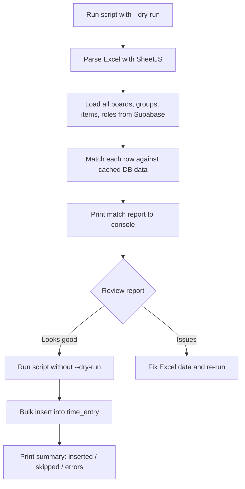

# 7pace Time Entry Import Plan

## Overview

One-time migration: import historical time entries from a 7pace Excel export into the timetracker database via a standalone Node.js script.

## Prerequisites

- All users must be pre-created in `user_profiles`. The Excel will have `user_id` (UUID) replacing the "Person" column.
- Boards, groups, items, and roles should already exist in the database.
- Phase 1 of [`optimize-task-item-selector.md`](plans/optimize-task-item-selector.md) must be completed first (for `monday_group` table and `group_id` on `monday_item`).

## Data Mapping

| 7pace Column | Target | Matching Strategy |
|---|---|---|
| Person → user_id | `time_entry.user_id` | Pre-replaced by user with UUID |
| Board | `time_entry.board_id` | Match `monday_board.name` |
| Group | via `monday_item.group_id` | Match `monday_group.title` within matched board |
| Item Name | `time_entry.item_id` | Match `monday_item.name` within matched board + group |
| Parent Item | `time_entry.parent_item_id` | Match `monday_item.name` within matched board |
| Date Logged + Start | `time_entry.start_time` | Parse DD.MM.YYYY + HH:mm:ss → ISO timestamp |
| Date Logged + End | `time_entry.end_time` | Parse DD.MM.YYYY + HH:mm:ss → ISO timestamp |
| Logged Time | `time_entry.duration` | Convert decimal hours to seconds (1.5 → 5400) |
| Rolle | `time_entry.role_id` | Match `role.name` |
| Comment | `time_entry.comment` | Direct mapping, skip "N/A" values |

## Simplified Approach: Standalone Script

Since this is a **one-time migration**, we skip UI/API routes entirely and use a CLI script.

### Script: `scripts/import-7pace.ts`

```
Usage:
  npx tsx scripts/import-7pace.ts <path-to-excel> [--dry-run] [--skip-unmatched]
```

### Flow



### What the script does

1. **Parse** the Excel file using `xlsx` (installed as dev dependency only)
2. **Load dimension tables** once: all boards, groups, items, roles from Supabase
3. **Match each row**: board by name → group by title within board → item by name within board+group → role by name
4. **Dry-run mode** (`--dry-run`): prints match report — matched/unmatched rows with reasons — no DB writes
5. **Import mode**: inserts matched rows into `time_entry` with `is_draft=false`, `synced_to_monday=false`
6. **Duplicate check**: skip rows where `user_id + start_time + item_id` already exists

### Files

| File | Purpose |
|---|---|
| `scripts/import-7pace.ts` | The complete import script |

One file. That's it. The `xlsx` package is a dev dependency only.

## Key Decisions

1. **No admin UI** — one-time script is sufficient
2. **No API routes** — script connects directly to Supabase
3. **Dry-run first** — always run with `--dry-run` to review before importing
4. **`--skip-unmatched`** — optionally import partial matches (item_id=null) instead of failing
5. **Dates** parsed from German locale (DD.MM.YYYY) + time (HH:mm:ss)
6. **Duration** = decimal hours × 3600 → seconds
7. **Group/Workspace** columns: Group is used for matching context; Workspace is ignored (no schema field)
