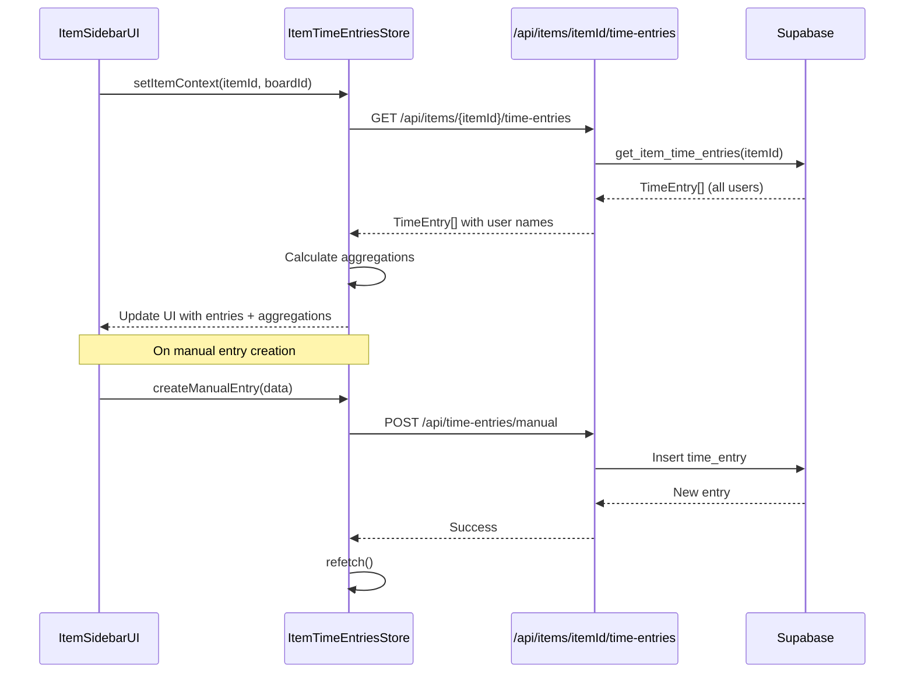

# Item Sidebar Time Tracking Widget - Implementation Plan

## Executive Summary

This document outlines the technical implementation plan for a monday.com item sidebar widget that enables comprehensive time tracking for specific items. The widget will display time entries from all users, support manual entry creation, and provide self-service editing for personal entries—explicitly excluding the active timer functionality present in the dashboard widget.

---

## Table of Contents

1. [Scope Definition](#scope-definition)
2. [Architecture Overview](#architecture-overview)
3. [Dashboard Component Audit](#dashboard-component-audit)
4. [Component Decomposition Strategy](#component-decomposition-strategy)
5. [State Management Design](#state-management-design)
6. [Permission-Based Editing Logic](#permission-based-editing-logic)
7. [Shared Utility Migration Roadmap](#shared-utility-migration-roadmap)
8. [API Design](#api-design)
9. [Implementation Phases](#implementation-phases)

---

## Scope Definition

### In Scope

- **View All Interface**: Display time entries for a specific monday.com item across ALL users
- **Manual Entry Creation**: Create time entries for the current item without timer functionality
- **Self-Service Editing**: Users can edit/delete their own time entries only
- **Role-based Time Display**: Show time breakdown by role with aggregated totals
- **Date Filtering**: Filter entries by date range

### Explicitly Out of Scope

- Active timer functionality (play/pause/stop)
- Timer session management
- Draft time entries from timer sessions
- Cross-item time entry views (dashboard scope)

---

## Architecture Overview

```mermaid
graph TB
    subgraph ItemSidebar[Item Sidebar Widget]
        ISP[ItemViewPage]
        ISH[ItemSidebarHeader]
        TEL[TimeEntryListView]
        MTF[ManualTimeEntryForm]
        ETM[EditTimeEntryModal]
    end

    subgraph SharedComponents[Shared Component Library]
        TET[TimeEntryTable]
        TER[TimeEntryRow]
        TEFD[TimeEntryFormFields]
        DCM[DeleteConfirmModal]
    end

    subgraph SharedStores[Shared Stores]
        ITES[ItemTimeEntriesStore]
        US[UserStore]
        MS[MondayStore]
    end

    subgraph SharedUtils[Shared Utilities]
        TU[Time Utils]
        DU[Duration Utils]
        PU[Permission Utils]
    end

    subgraph API[API Routes]
        ITEAPI[/api/items/itemId/time-entries]
        TEAPI[/api/time-entries]
    end

    ISP --> ISH
    ISP --> TEL
    ISP --> MTF
    ISP --> ETM

    TEL --> TET
    TET --> TER
    MTF --> TEFD
    ETM --> TEFD
    ETM --> DCM

    TEL --> ITES
    MTF --> ITES
    ETM --> ITES

    ITES --> ITEAPI
    MTF --> TEAPI

    TER --> TU
    TER --> DU
    TER --> PU
```

---

## Dashboard Component Audit

### Current Dashboard Components Analysis

| Component | Location | Reusability | Action Required |
|-----------|----------|-------------|-----------------|
| [`TimeEntriesTable`](components/dashboard/TimeEntriesTable.tsx:31) | `components/dashboard/` | Medium | Extract table logic to shared component |
| [`EditTimeEntryModal`](components/dashboard/EditTimeEntryModal.tsx:73) | `components/dashboard/` | High | Migrate to shared with permission prop |
| [`SaveTimerModal`](components/dashboard/SaveTimerModal.tsx:1) | `components/dashboard/` | Low | Dashboard-specific, no migration |
| [`TimeEntryRowMenu`](components/dashboard/TimeEntryRowMenu.tsx:1) | `components/dashboard/` | High | Migrate to shared with permission checks |
| [`BulkActionButtons`](components/dashboard/BulkActionButtons.tsx:1) | `components/dashboard/` | Medium | Migrate with owner-check filter |
| [`DeleteConfirmationDialog`](components/dashboard/DeleteConfirmationDialog.tsx:1) | `components/dashboard/` | High | Migrate to shared directly |
| [`ManualTimeEntryModal`](components/features/timer/ManualTimeEntryModal.tsx:65) | `components/features/timer/` | High | Extract form fields, create item-context version |

### Reusable Functions Identified

**Time Calculation Utilities** (Duplicated in 3+ files):

```typescript
// Found in: EditTimeEntryModal.tsx, ManualTimeEntryModal.tsx, SaveTimerModal.tsx
getCurrentTimeString()           // Line 31, 23, 24
addSecondsToTimeString()         // Line 37, 29, 30  
subtractSecondsFromTimeString()  // Line 46, 38, 39
calculateDurationBetweenTimes()  // Line 58, 50, 51
durationToSeconds()              // Line 94, 86, 89
secondsToDuration()              // Line 100, 92, 95
```

**Format Utilities** (Already in [`lib/utils.ts`](lib/utils.ts:1)):

```typescript
formatDuration()                 // Line 6
formatTimestamp()                // Line 35
formatTime()                     // Line 51
roundDuration()                  // Line 72
combineDateAndTime()             // Line 86
```

---

## Component Decomposition Strategy

### Phase 1: Create Shared Component Library Structure

```
components/
├── shared/
│   ├── time-entries/
│   │   ├── TimeEntryTable.tsx        # Generic table component
│   │   ├── TimeEntryRow.tsx          # Row with permission-aware actions
│   │   ├── TimeEntryFormFields.tsx   # Reusable form field group
│   │   ├── TimeEntryRowMenu.tsx      # Context menu with permission checks
│   │   └── DeleteConfirmationDialog.tsx
│   ├── modals/
│   │   └── index.ts                  # Re-export from ui/modals
│   └── hooks/
│       ├── useTimeEntryPermissions.ts
│       └── useTimeCalculations.ts
├── dashboard/                        # Dashboard-specific components
│   ├── TimeEntriesTableDashboard.tsx # Dashboard wrapper
│   └── ...
└── sidebar/                          # Sidebar-specific components
    ├── ItemTimeEntriesView.tsx       # Item sidebar wrapper
    ├── ItemManualEntryModal.tsx      # Item-context manual entry
    └── ItemSidebarHeader.tsx
```

### Phase 2: Extract Shared Form Fields Component

**New: [`TimeEntryFormFields.tsx`](components/shared/time-entries/TimeEntryFormFields.tsx)**

```typescript
interface TimeEntryFormFieldsProps {
  // Core fields
  date: Date;
  onDateChange: (date: Date) => void;
  duration: string;
  onDurationChange: (duration: string) => void;
  startTime: string;
  onStartTimeChange: (time: string) => void;
  endTime: string;
  onEndTimeChange: (time: string) => void;
  comment: string;
  onCommentChange: (comment: string) => void;
  
  // Optional fields for dashboard context
  taskSelector?: {
    show: boolean;
    selectedTask: TaskSelection | null;
    onTaskChange: (task: TaskSelection) => void;
  };
  
  // Lock behavior
  isLocked: boolean;
  onLockToggle: () => void;
  
  // Validation state
  errors?: Record<string, string>;
}
```

### Phase 3: Create Permission-Aware Row Component

**New: [`TimeEntryRow.tsx`](components/shared/time-entries/TimeEntryRow.tsx)**

```typescript
interface TimeEntryRowProps {
  entry: TimeEntry;
  currentUserId: string;
  isSelected: boolean;
  onSelect: (id: string, selected: boolean) => void;
  onEdit?: (entry: TimeEntry) => void;
  onDelete?: (entry: TimeEntry) => void;
  
  // Permission configuration
  permissions: {
    canEdit: boolean;       // Derived from ownership check
    canDelete: boolean;     // Derived from ownership check
    showUserColumn: boolean; // True for multi-user views
  };
}
```

---

## State Management Design

### New Store: [`itemTimeEntriesStore.ts`](stores/itemTimeEntriesStore.ts)

```typescript
interface ItemTimeEntriesState {
  // Current item context
  itemId: string | null;
  boardId: string | null;
  
  // Entries data - all users
  timeEntries: TimeEntry[];
  
  // Aggregations
  totalDuration: number;
  durationByRole: Record<string, { roleId: string; roleName: string; duration: number }>;
  durationByUser: Record<string, { userId: string; userName: string; duration: number }>;
  
  // Loading states
  loading: boolean;
  error: string | null;
  
  // Filters
  filters: {
    dateRange: { start: Date | null; end: Date | null };
    roleId: string | null;
    userId: string | null;
  };
  
  // Actions
  setItemContext: (itemId: string, boardId: string) => void;
  fetchItemTimeEntries: () => Promise<void>;
  createManualEntry: (entry: ManualEntryInput) => Promise<void>;
  updateEntry: (id: string, updates: Partial<TimeEntry>) => Promise<void>;
  deleteEntry: (id: string) => Promise<void>;
  setFilters: (filters: Partial<ItemTimeEntriesState['filters']>) => void;
  refetch: () => Promise<void>;
}
```

### Multi-User Data Flow



---

## Permission-Based Editing Logic

### Permission Utility: [`useTimeEntryPermissions.ts`](lib/permissions/useTimeEntryPermissions.ts)

```typescript
interface TimeEntryPermissions {
  canView: boolean;      // Always true for item entries
  canCreate: boolean;    // True for authenticated users
  canEdit: boolean;      // True only for entry owner
  canDelete: boolean;    // True only for entry owner
  canBulkSelect: boolean; // True only for own entries
}

function useTimeEntryPermissions(entry: TimeEntry): TimeEntryPermissions {
  const currentUserId = useUserStore((s) => s.supabaseUser?.id);
  const isOwner = entry.user_id === currentUserId;
  
  return {
    canView: true,
    canCreate: !!currentUserId,
    canEdit: isOwner,
    canDelete: isOwner,
    canBulkSelect: isOwner,
  };
}
```

### Permission Matrix

| Action | Owner | Other Users | Notes |
|--------|-------|-------------|-------|
| View entry | ✅ | ✅ | All entries visible |
| Create entry | ✅ | ✅ | Creates for self only |
| Edit entry | ✅ | ❌ | UI hides edit button |
| Delete entry | ✅ | ❌ | UI hides delete option |
| Bulk select | ✅ | ❌ | Checkbox disabled |

### UI Implementation Pattern

```typescript
// In TimeEntryRow component
function TimeEntryRow({ entry, currentUserId }: Props) {
  const permissions = useTimeEntryPermissions(entry);
  
  return (
    <Table.Row>
      <Table.Cell>
        <Checkbox 
          disabled={!permissions.canBulkSelect}
          // ...
        />
      </Table.Cell>
      {/* ... other cells ... */}
      <Table.Cell>
        {permissions.canEdit && (
          <TimeEntryRowMenu 
            onEdit={() => handleEdit(entry)}
            onDelete={() => handleDelete(entry)}
          />
        )}
      </Table.Cell>
    </Table.Row>
  );
}
```

---

## Shared Utility Migration Roadmap

### Phase 1: Time Calculation Utilities

**Create: [`lib/time/calculations.ts`](lib/time/calculations.ts)**

Migrate duplicated functions from:

- [`EditTimeEntryModal.tsx`](components/dashboard/EditTimeEntryModal.tsx:31-71)
- [`ManualTimeEntryModal.tsx`](components/features/timer/ManualTimeEntryModal.tsx:23-63)
- [`SaveTimerModal.tsx`](components/dashboard/SaveTimerModal.tsx)

```typescript
// lib/time/calculations.ts

/**
 * Get current time as HH:MM string
 */
export function getCurrentTimeString(): string;

/**
 * Add seconds to a HH:MM time string
 */
export function addSecondsToTimeString(timeStr: string, seconds: number): string;

/**
 * Subtract seconds from a HH:MM time string
 */
export function subtractSecondsFromTimeString(timeStr: string, seconds: number): string;

/**
 * Calculate duration in seconds between two HH:MM time strings
 */
export function calculateDurationBetweenTimes(startTime: string, endTime: string): number;

/**
 * Convert HH:MM to seconds
 */
export function durationToSeconds(timeStr: string): number;

/**
 * Convert seconds to HH:MM
 */
export function secondsToDuration(seconds: number): string;
```

### Phase 2: Create Custom Hook for Time Entry Form

**Create: [`hooks/useTimeEntryForm.ts`](components/shared/hooks/useTimeEntryForm.ts)**

```typescript
interface UseTimeEntryFormOptions {
  initialValues?: {
    date?: Date;
    duration?: string;
    startTime?: string;
    endTime?: string;
    comment?: string;
  };
  onSubmit: (values: TimeEntryFormValues) => Promise<void>;
}

function useTimeEntryForm(options: UseTimeEntryFormOptions) {
  // Manages state synchronization between duration/start/end times
  // Handles lock toggle behavior
  // Provides validation
  // Returns form state and handlers
}
```

### Phase 3: Reorganize lib/ Directory

```
lib/
├── time/
│   ├── calculations.ts      # Time string manipulations
│   ├── formatting.ts        # Display formatting (move from utils.ts)
│   └── index.ts
├── permissions/
│   ├── timeEntry.ts         # Time entry permission checks
│   └── index.ts
├── database/
│   ├── users.ts             # Existing
│   ├── timeEntries.ts       # Extract from database.ts
│   └── items.ts             # New: item-specific queries
├── monday/
│   ├── utils.ts             # Existing
│   └── columnSync.ts        # Existing
├── supabase/
│   ├── client.ts            # Existing
│   └── server.ts            # Existing
├── utils.ts                 # General utilities (reduced)
├── redis.ts                 # Existing
└── store-utils.ts           # Existing
```

---

## API Design

### New Endpoint: Get Item Time Entries

**Route**: `GET /api/items/[itemId]/time-entries`

**Request**:

```
GET /api/items/{itemId}/time-entries?boardId={boardId}&startDate={ISO}&endDate={ISO}
```

**Response**:

```typescript
interface ItemTimeEntriesResponse {
  entries: TimeEntry[];
  aggregations: {
    totalDuration: number;
    byRole: Array<{
      roleId: string;
      roleName: string;
      totalDuration: number;
      entryCount: number;
    }>;
    byUser: Array<{
      userId: string;
      userName: string;
      totalDuration: number;
      entryCount: number;
    }>;
  };
}
```

### Database Function Required

**New RPC: `get_item_time_entries`**

```sql
CREATE OR REPLACE FUNCTION public.get_item_time_entries(
    p_item_id TEXT,
    p_board_id TEXT,
    p_start_date TIMESTAMPTZ DEFAULT NULL,
    p_end_date TIMESTAMPTZ DEFAULT NULL
)
RETURNS TABLE (
    id UUID,
    user_id UUID,
    user_name TEXT,
    task_name TEXT,
    start_time TIMESTAMPTZ,
    end_time TIMESTAMPTZ,
    duration INTEGER,
    board_id TEXT,
    board_name TEXT,
    item_id TEXT,
    item_name TEXT,
    parent_item_id TEXT,
    parent_item_name TEXT,
    role_id UUID,
    role_name TEXT,
    comment TEXT,
    is_draft BOOLEAN,
    synced_to_monday BOOLEAN,
    created_at TIMESTAMPTZ,
    updated_at TIMESTAMPTZ
) AS $$
BEGIN
    RETURN QUERY
    SELECT
        te.id,
        te.user_id,
        up.name as user_name,
        COALESCE(mi.name, 'Unzugeordneter Zeiteintrag') as task_name,
        te.start_time,
        te.end_time,
        te.duration,
        te.board_id,
        mb.name as board_name,
        te.item_id,
        mi.name as item_name,
        te.parent_item_id,
        mpi.name as parent_item_name,
        te.role_id,
        r.name as role_name,
        te.comment,
        te.is_draft,
        te.synced_to_monday,
        te.created_at,
        te.updated_at
    FROM public.time_entry te
    LEFT JOIN public.user_profiles up ON te.user_id = up.id
    LEFT JOIN public.monday_board mb ON te.board_id = mb.id
    LEFT JOIN public.monday_item mi ON te.item_id = mi.id
    LEFT JOIN public.monday_item mpi ON te.parent_item_id = mpi.id
    LEFT JOIN public.role r ON te.role_id = r.id
    WHERE te.item_id = p_item_id
      AND te.board_id = p_board_id
      AND te.deleted_at IS NULL
      AND te.is_draft = FALSE
      AND (p_start_date IS NULL OR te.start_time >= p_start_date)
      AND (p_end_date IS NULL OR te.start_time <= p_end_date)
    ORDER BY te.start_time DESC;
END;
$$ LANGUAGE plpgsql SECURITY DEFINER;
```

---

## Implementation Phases

### Phase 1: Foundation (Shared Utilities & Types)

- [ ] Create `lib/time/calculations.ts` with extracted time utilities
- [ ] Create `lib/time/formatting.ts` with display formatters
- [ ] Create `lib/permissions/timeEntry.ts` with permission utilities
- [ ] Update `lib/utils.ts` to re-export from new modules
- [ ] Update existing components to use new utility imports

### Phase 2: Shared Components

- [ ] Create `components/shared/time-entries/TimeEntryFormFields.tsx`
- [ ] Create `components/shared/time-entries/TimeEntryRow.tsx`
- [ ] Create `components/shared/time-entries/TimeEntryTable.tsx`
- [ ] Migrate `DeleteConfirmationDialog.tsx` to shared
- [ ] Create `components/shared/hooks/useTimeEntryForm.ts`
- [ ] Create `components/shared/hooks/useTimeEntryPermissions.ts`

### Phase 3: State Management

- [ ] Create `stores/itemTimeEntriesStore.ts`
- [ ] Add database function `get_item_time_entries`
- [ ] Create API route `app/api/items/[itemId]/time-entries/route.ts`
- [ ] Update `lib/database.ts` with item-specific query helpers

### Phase 4: Item Sidebar Implementation

- [ ] Create `components/sidebar/ItemSidebarHeader.tsx`
- [ ] Create `components/sidebar/ItemTimeEntriesView.tsx`
- [ ] Create `components/sidebar/ItemManualEntryModal.tsx`
- [ ] Update `app/sidebar/itemView/page.tsx` with full implementation

### Phase 5: Dashboard Migration

- [ ] Refactor `TimeEntriesTable.tsx` to use shared components
- [ ] Refactor `EditTimeEntryModal.tsx` to use `TimeEntryFormFields`
- [ ] Refactor `ManualTimeEntryModal.tsx` to use `TimeEntryFormFields`
- [ ] Remove duplicated utility functions from component files

### Phase 6: Testing & Polish

- [ ] Add unit tests for time calculation utilities
- [ ] Add unit tests for permission utilities
- [ ] Integration test item sidebar with mock monday.com context
- [ ] Accessibility audit for sidebar components
- [ ] Performance optimization for large entry lists

---

## Risk Assessment

| Risk | Impact | Mitigation |
|------|--------|------------|
| Breaking dashboard during refactor | High | Incremental migration with feature flags |
| monday.com SDK sidebar context differences | Medium | Early spike to validate context availability |
| Performance with large multi-user entry sets | Medium | Pagination in API, virtualized list in UI |
| Permission edge cases | Low | Comprehensive test coverage for permission logic |

---

## Open Questions for Discussion

1. **Date range defaults**: Should the item sidebar show entries from:
   - All time (default)
   - Last 30 days
   - Current sprint/cycle

2. **Aggregation display**: Should role/user breakdowns be:
   - Collapsible sections
   - Summary cards at top
   - Separate tab/view

3. **Bulk operations**: Should users be able to bulk delete their own entries in the sidebar?

4. **Offline support**: Is offline entry creation a requirement for the sidebar?

---

## Appendix: File Reference Map

### Files to Create

| Path | Purpose |
|------|---------|
| `lib/time/calculations.ts` | Time string manipulation utilities |
| `lib/time/formatting.ts` | Display formatting utilities |
| `lib/time/index.ts` | Barrel export |
| `lib/permissions/timeEntry.ts` | Permission check utilities |
| `stores/itemTimeEntriesStore.ts` | Item-specific time entries state |
| `components/shared/time-entries/TimeEntryFormFields.tsx` | Reusable form fields |
| `components/shared/time-entries/TimeEntryRow.tsx` | Permission-aware row |
| `components/shared/time-entries/TimeEntryTable.tsx` | Generic table component |
| `components/shared/hooks/useTimeEntryForm.ts` | Form state management hook |
| `components/shared/hooks/useTimeEntryPermissions.ts` | Permission hook |
| `components/sidebar/ItemSidebarHeader.tsx` | Sidebar header component |
| `components/sidebar/ItemTimeEntriesView.tsx` | Main entries view |
| `components/sidebar/ItemManualEntryModal.tsx` | Item-context manual entry |
| `app/api/items/[itemId]/time-entries/route.ts` | Item entries API |
| `supabase/migrations/007_item_time_entries.sql` | New RPC function |

### Files to Modify

| Path | Changes |
|------|---------|
| `lib/utils.ts` | Re-export from new modules |
| `components/dashboard/TimeEntriesTable.tsx` | Use shared components |
| `components/dashboard/EditTimeEntryModal.tsx` | Use shared form fields |
| `components/features/timer/ManualTimeEntryModal.tsx` | Use shared form fields |
| `components/dashboard/SaveTimerModal.tsx` | Use shared utilities |
| `app/sidebar/itemView/page.tsx` | Full implementation |
| `lib/database.ts` | Add item-specific helpers |
