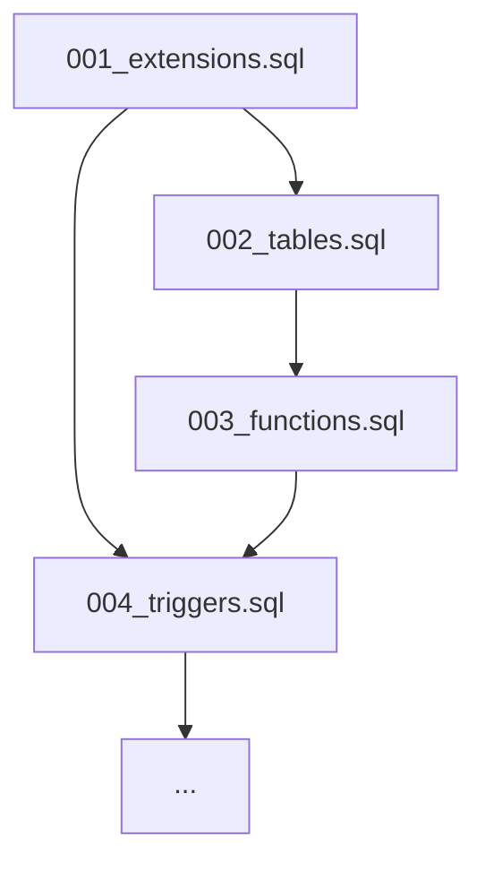

# Plan: Migration Consolidation and Backend Alignment

The goal is to consolidate the Supabase migration files to ensure they are complete, maintainable, and aligned with the backend's requirements as defined in the TypeScript types and API routes. We will move away from the "snapshot" approach of the sync file and restore a clean, numbered migration sequence.

## Current State Analysis

- **001_extensions.sql**: Missing or incomplete (contains `uuid-ossp` and `update_updated_at_column` if created, but `pg_cron` is missing).
- **003_functions.sql**: Contains some core functions but is missing many timer-related RPCs.
- **20260122075334_sync_local_changes.sql**: Contains the "delta" of missing functions and extensions but is poorly named and redundant.
- **007_alters.sql**: Contains critical table definitions (`board_config`, etc.) that are correctly aligned with types.

## Proposed Migration Structure

### 1. `001_extensions.sql` (Initialization)

- Enable `uuid-ossp`
- Enable `pg_cron`
- Define `update_updated_at_column()` helper function.

### 2. `002_tables.sql` (Schema)

- Keep as is, but ensure `CREATE EXTENSION` is removed (moved to 001).

### 3. `003_functions.sql` (Logic)

- Merge all functions from the current `003` and the `sync_local_changes` file.
- Ensure the following are present:
  - `get_user_time_entries`
  - `create_timer_session`
  - `get_active_timer_session`
  - `finalize_time_entry`
  - `soft_reset_timer`
  - `get_item_time_by_role`
  - `finalize_draft`
  - `finalize_segment`
  - `get_current_elapsed_time`
  - `get_timer_session_with_elapsed`
  - `add_default_roles`

### 4. `004_triggers.sql` (Automation)

- Keep as is (depends on 001).

### 5. `seed.sql` (Data)

- Add a call to `SELECT add_default_roles();` to ensure the database is populated on reset.

## Execution Steps

1. **Refactor 001**: Update/Create `001_extensions.sql`.
2. **Clean 002**: Remove extension from `002_tables.sql`.
3. **Merge 003**: Rewrite `003_functions.sql` to include all logic.
4. **Update Seed**: Add role seeding to `supabase/seed.sql`.
5. **Clean up**: Delete the sync migration file.
6. **Verify**: Run `npm run db:reset`.

## Dependency Graph

