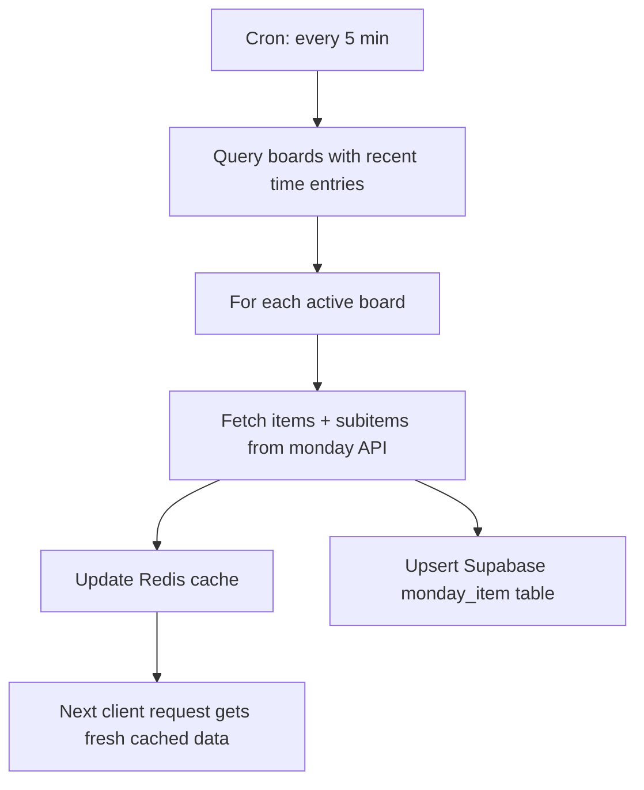
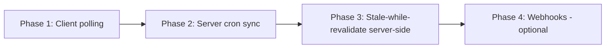

# Optimize Task Item Selector - Auto-Refresh Strategy

## Problem

Users must manually hit the refresh button when tasks are missing or stale in the TaskItemSelector. The goal is to keep the item list always up-to-date automatically.

## Current Architecture

| Layer | Mechanism | TTL | Notes |
|-------|-----------|-----|-------|
| Client - React Query | `staleTime: 5min`, `gcTime: 15min` | 5-15 min | No `refetchInterval`, `refetchOnWindowFocus: false` |
| Server - Redis | `CACHE_TTL.TASKS = 30min` | 30 min | Full cache-or-miss; no background revalidation |
| Server - Supabase | `monday_item` dimension table | Persistent | Updated on cache miss via fire-and-forget upserts |
| Manual refresh | `POST /api/tasks/refresh` → invalidates Redis → React Query refetch | On-demand | Only way to get fresh data today |

## Proposed Strategy: Multi-Layer Auto-Refresh

### 1. Client-Side Polling with React Query `refetchInterval`

**File:** [`TaskItemSelector.tsx`](components/TaskItemSelector.tsx)

- Add `refetchInterval: 2 * 60 * 1000` (2 minutes) to the tasks query when the selector is open/active
- Keep `refetchOnWindowFocus: true` (change from `false`) so returning to the tab gets fresh data
- The stale-while-revalidate pattern already in place (`placeholderData`) means users see cached data instantly while fresh data loads in background

### 2. Server-Side Cron Job for Periodic Board Sync

**New file:** `app/api/cron/sync-boards/route.ts`

- Create a cron endpoint that runs every 5 minutes
- For each board that has active users (boards with recent time entries), re-fetch items/subitems from monday.com API and update both Redis cache and Supabase dimension tables
- This keeps the Redis cache warm so client requests are always fast cache hits with recent data

### 3. Reduce Redis TTL + Serve Stale While Refreshing

**File:** [`lib/monday.ts`](lib/monday.ts)

- Reduce `CACHE_TTL.TASKS` from 30 min → 10 min
- Add a `CACHE_TTL.TASKS_STALE` of 30 min as a soft-expiry marker
- On cache hit: if data is older than 10 min but younger than 30 min, return cached data AND trigger a background refresh (stale-while-revalidate at the server level)
- This ensures users never wait for API calls while still getting reasonably fresh data

### 4. monday.com Webhooks for Real-Time Updates (Optional/Future)

**New file:** `app/api/webhooks/monday/route.ts`

- Register webhooks for `create_item`, `delete_item`, `change_name` events on connected boards
- On webhook receipt, invalidate the specific board's Redis cache
- This would make updates near-instant but adds complexity (webhook management, verification, etc.)
- **Recommendation:** Implement as Phase 2 after polling is working well

## Implementation Priority

## Detailed Changes

### Phase 1: Client-Side Polling

- **[`TaskItemSelector.tsx`](components/TaskItemSelector.tsx:276)** — Tasks query: add `refetchInterval: 2 * 60 * 1000`, change `refetchOnWindowFocus: true`
- **[`TaskItemSelector.tsx`](components/TaskItemSelector.tsx:215)** — Boards query: change `refetchOnWindowFocus: true`
- Keep the refresh button but it becomes a "force refresh" for impatient users

### Phase 2: Server-Side Cron Board Sync

- Create `app/api/cron/sync-boards/route.ts` — query active boards from Supabase, call [`getBoardTasks()`](lib/monday.ts:205) for each, which already populates both Redis and Supabase
- Add cron schedule to deployment config (e.g., Vercel cron or external scheduler) — every 5 minutes
- Add a helper in [`lib/monday.ts`](lib/monday.ts) to get active board IDs from recent time entries

### Phase 3: Server-Side Stale-While-Revalidate

- **[`lib/monday.ts`](lib/monday.ts:7)** — Add `TASKS_STALE: 60 * 10` (10 min soft TTL)
- **[`lib/redis.ts`](lib/redis.ts:29)** — Add `setWithTimestamp()` helper that stores `{data, cachedAt}`
- **[`lib/monday.ts`](lib/monday.ts:222)** — In `getBoardTasks()`: check `cachedAt`, if stale but not expired, return data and trigger background refresh via `Promise.resolve().then(() => refreshInBackground(boardId))`

### Phase 4: Webhooks (Future)

- Register webhooks via monday.com API for connected boards
- Create webhook handler endpoint
- On item change events, invalidate specific board cache in Redis

## Expected Outcome

- Phase 1 alone reduces perceived staleness from "until manual refresh" to ~2 minutes max
- Phase 2 keeps Redis warm, making all client requests fast cache hits
- Phase 3 eliminates the cold-cache penalty even when cron hasn't run recently
- Combined: users should almost never see stale task lists
