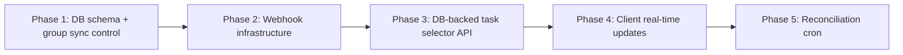
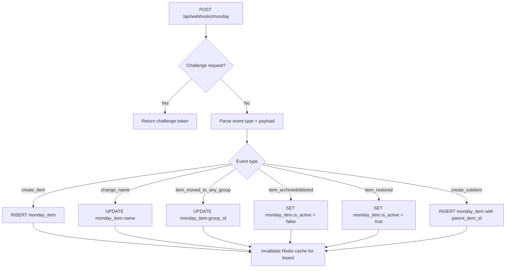
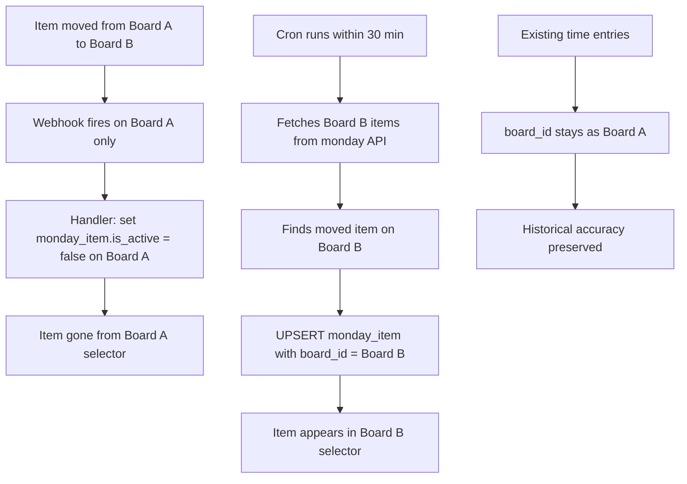
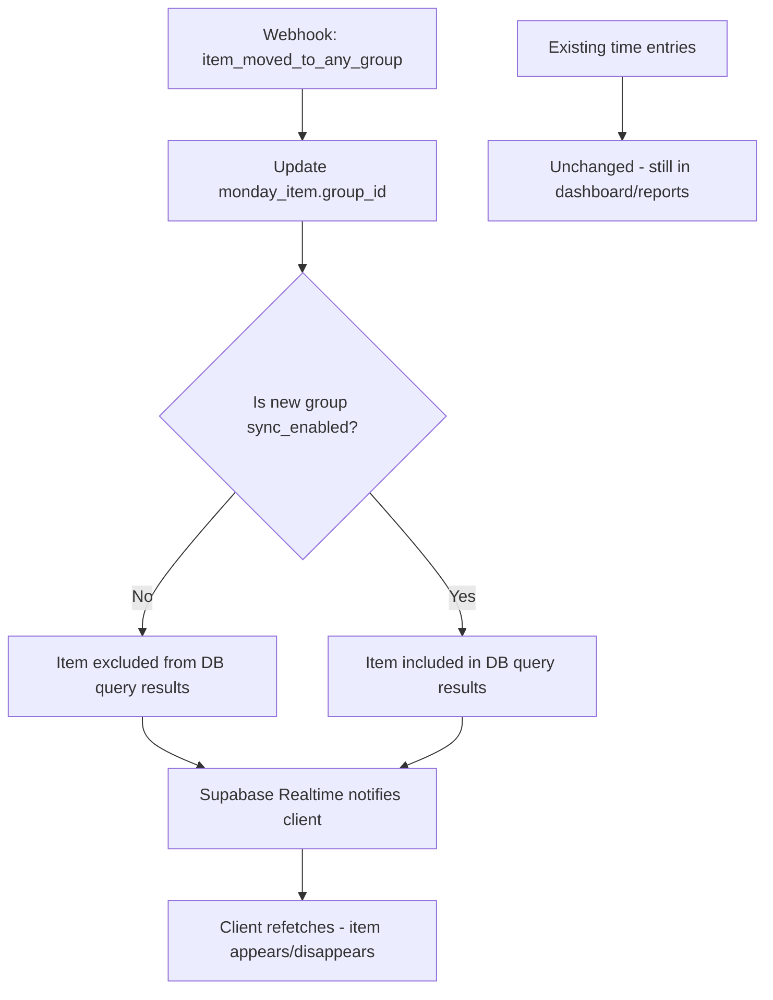

# Optimize Task Item Selector — Webhook-First Architecture

## Problem

1. Users must manually refresh when tasks are missing/stale
2. Archive/completed items clutter the selector
3. Monday API calls are slow and complexity-limited

## Architecture Shift: DB-First Instead of API-First

**Current flow:**

```
Client → API route → Redis cache → monday.com API → Response
```

**New flow with webhooks:**

```
monday.com → Webhook → Update DB ── DB is always current
Client → API route → Supabase query → Response (fast, no API calls)
```

With webhooks keeping `monday_item` and `monday_group` tables in sync, the task selector reads from the database directly. Monday API calls are eliminated from the hot path entirely.

---

## Phase Overview



---

## Phase 1: Database Schema + Group Sync Control

**Goal:** Store groups with sync control, add group_id to items.

### New Table: `monday_group`

```sql
CREATE TABLE monday_group (
    id TEXT NOT NULL,
    board_id TEXT NOT NULL REFERENCES monday_board(id),
    title TEXT NOT NULL,
    position TEXT,
    sync_enabled BOOLEAN NOT NULL DEFAULT true,
    color TEXT,
    updated_at TIMESTAMPTZ NOT NULL DEFAULT now(),
    PRIMARY KEY (board_id, id)
);

CREATE INDEX idx_monday_group_board ON monday_group(board_id);
CREATE INDEX idx_monday_group_sync ON monday_group(board_id, sync_enabled);
```

### Alter `monday_board`

```sql
ALTER TABLE monday_board ADD COLUMN workspace_id TEXT;
ALTER TABLE monday_board ADD COLUMN board_kind TEXT;  -- 'public', 'private', 'share'
ALTER TABLE monday_board ADD COLUMN state TEXT;       -- 'active', 'archived', 'deleted'
```

`workspace_id` is important because:

- Archive boards live in a different workspace than project boards
- Enables scoping queries by workspace
- Webhook payloads include `boardId` but not workspace — having it in DB provides context
- Future multi-workspace support is pre-wired

`board_kind` and `state` are cheap to store and useful for filtering (e.g., skip archived boards in cron).

### Alter `monday_item`

```sql
ALTER TABLE monday_item ADD COLUMN group_id TEXT;
ALTER TABLE monday_item ADD COLUMN is_active BOOLEAN NOT NULL DEFAULT true;

CREATE INDEX idx_monday_item_board_group ON monday_item(board_id, group_id);
CREATE INDEX idx_monday_item_active ON monday_item(board_id, is_active);
```

`is_active` = false when item is archived/deleted via webhook.

### Admin UI for Group Sync

Extend [`app/admin/boards/[boardId]/page.tsx`](app/admin/boards/[boardId]/page.tsx):

- "Groups" section showing all groups with sync toggles
- Initial group load from monday API → upsert into `monday_group`

### New API: `app/api/admin/boards/[boardId]/groups/route.ts`

- `GET` — Fetch groups from monday API, upsert into DB, return with sync status
- `PATCH` — Toggle `sync_enabled`

### Files to create/modify

- `supabase/migrations/xxx_monday_group.sql` — new table + monday_board and monday_item alterations
- `app/api/admin/boards/[boardId]/groups/route.ts` — group management API
- [`app/admin/boards/[boardId]/page.tsx`](app/admin/boards/[boardId]/page.tsx) — admin UI
- [`types/database/database.ts`](types/database/database.ts) — regenerate types

---

## Phase 2: Webhook Infrastructure

**Goal:** Register webhooks and handle events to keep DB in sync.

### New Table: `monday_webhook`

```sql
CREATE TABLE monday_webhook (
    id TEXT PRIMARY KEY,
    board_id TEXT NOT NULL REFERENCES monday_board(id),
    event TEXT NOT NULL,
    url TEXT NOT NULL,
    is_active BOOLEAN NOT NULL DEFAULT true,
    created_at TIMESTAMPTZ NOT NULL DEFAULT now()
);
```

### Webhook Handler: `app/api/webhooks/monday/route.ts`

Single endpoint for all events. monday.com sends a `challenge` on registration that must be echoed back.

### Events and DB Actions

| Event | DB Action |
|---|---|
| `create_item` | `INSERT` into `monday_item` with board_id, group_id, name |
| `change_name` | `UPDATE monday_item SET name = :newName WHERE id = :itemId` |
| `item_moved_to_any_group` | `UPDATE monday_item SET group_id = :newGroupId` |
| `item_archived` | `UPDATE monday_item SET is_active = false` |
| `item_deleted` | `UPDATE monday_item SET is_active = false` |
| `item_restored` | `UPDATE monday_item SET is_active = true` |
| `create_subitem` | `INSERT` into `monday_item` with parent_item_id |
| `change_subitem_name` | `UPDATE monday_item SET name = :newName` |

### Webhook Registration Logic

When a board is configured in admin (or on first connect):

1. Query existing webhooks for the board via monday API
2. Register missing webhooks pointing to `/api/webhooks/monday`
3. Store webhook IDs in `monday_webhook` table

### Webhook Handler Flow



### Files to create/modify

- `supabase/migrations/xxx_monday_webhook.sql`
- `app/api/webhooks/monday/route.ts` — webhook handler
- `lib/monday/webhooks.ts` — registration + management helpers
- [`lib/monday.ts`](lib/monday.ts) — add webhook registration calls

---

## Phase 3: DB-Backed Task Selector API

**Goal:** Replace monday API calls with Supabase queries for the task selector.

### New/Modified: `app/api/tasks/route.ts`

Instead of calling [`getBoardTasks()`](lib/monday.ts:205) which hits the monday API:

```sql
SELECT 
    i.id,
    i.name,
    i.parent_item_id,
    i.group_id,
    g.title as group_title,
    parent.name as parent_item_name
FROM monday_item i
JOIN monday_group g ON g.id = i.group_id AND g.board_id = i.board_id
LEFT JOIN monday_item parent ON parent.id = i.parent_item_id
WHERE i.board_id = :boardId
  AND i.is_active = true
  AND g.sync_enabled = true
ORDER BY g.title, i.name;
```

This query:

- Filters out items in unsynced groups
- Filters out archived/deleted items
- Returns group structure for the dropdown
- Is fast (indexed DB query vs monday API)
- Needs no Redis cache (DB response is <50ms)

### Redis Cache Changes

- **Remove** Redis caching for tasks — DB is fast enough and always current
- **Keep** Redis for: boards list, user teams (these are less frequently updated and truly cacheable)
- The `CACHE_TTL.TASKS` constant and related Redis logic in [`getBoardTasks()`](lib/monday.ts:205) can be removed

### Keep `getBoardTasks()` for Initial Population

[`getBoardTasks()`](lib/monday.ts:205) still needed for:

- Initial board setup (populating items before webhooks are active)
- Reconciliation cron (Phase 5)
- Manual refresh fallback

But it's no longer in the request hot path.

### Files to modify

- [`app/api/tasks/route.ts`](app/api/tasks/route.ts) — query DB instead of monday API
- [`lib/monday.ts`](lib/monday.ts) — keep getBoardTasks but remove from hot path
- [`lib/database.ts`](lib/database.ts) — add `getTasksFromDB()` helper

---

## Phase 4: Client Real-Time Updates

**Goal:** Client knows immediately when task list changes.

### Two options

**Option A: Supabase Realtime (recommended)**

Subscribe to changes on `monday_item` table filtered by board_id. When a webhook updates an item, Supabase Realtime pushes the change to the client.

```typescript
// In TaskItemSelector
supabase
    .channel('task-changes')
    .on('postgres_changes', {
        event: '*',
        schema: 'public',
        table: 'monday_item',
        filter: `board_id=eq.${selectedBoard.value}`
    }, () => {
        // Invalidate React Query cache to trigger refetch from DB-backed API
        queryClient.invalidateQueries({ queryKey: ['tasks', selectedBoard.value] });
    })
    .subscribe();
```

- No polling needed
- Updates arrive in <1 second after webhook processes
- React Query refetches from the fast DB-backed API

**Option B: Short polling fallback**

If Supabase Realtime isn't available or reliable:

- `refetchInterval: 30 * 1000` (30 seconds — can be shorter since DB queries are cheap)
- `refetchOnWindowFocus: true`

### Remove manual refresh button?

With Supabase Realtime, the refresh button becomes largely unnecessary. Keep it as a fallback but de-emphasize it visually.

### Files to modify

- [`components/TaskItemSelector.tsx`](components/TaskItemSelector.tsx) — add Supabase Realtime subscription OR polling

---

## Phase 5: Reconciliation Cron

**Goal:** Safety net to catch any missed webhooks or drift.

### New Route: `app/api/cron/sync-boards/route.ts`

- Runs every 30 minutes (less frequent since webhooks handle real-time)
- For each board with active users in the last 24h:
  1. Fetch full item list from monday API via [`getBoardTasks()`](lib/monday.ts:205)
  2. Compare with `monday_item` table
  3. Upsert differences (new items, name changes, removed items)
  4. Sync group list → `monday_group` table
- Also verifies webhooks are still active and re-registers if needed

### Files to create

- `app/api/cron/sync-boards/route.ts`

---

## Edge Cases

### Item Moved to Different Board (Cross-Board Move)

**Scenario:** An item is moved from Board A to Board B in monday.com.

**What monday.com does:**

- Fires `item_moved_to_any_group` webhook on the **source board only** (Board A)
- Does NOT fire any webhook on the target board (Board B)
- The item gets a new ID on Board B in some cases, or keeps its ID depending on the move type

**Webhook handling (immediate):**

1. Source Board A receives `item_moved_to_any_group`
2. The item no longer exists on Board A → webhook handler checks if item still exists on the board
3. If item is gone from Board A: set `monday_item.is_active = false` for that item on Board A
4. Item disappears from Board A's task selector immediately

**Reconciliation cron handling (within 30 min):**

1. Cron fetches full item list from monday API for each active board
2. **Board A:** Moved item not in API response → confirm `is_active = false` (already done by webhook)
3. **Board B:** If Board B is a connected/active board, moved item appears in API response → `INSERT/UPSERT` into `monday_item` with `board_id = B`, `is_active = true`
4. Item now appears in Board B's task selector

**The gap:** Between webhook and next cron run (up to 30 min), the item exists in neither board's selector. This is acceptable because:

- Cross-board moves are rare operational events
- The item was intentionally moved — brief absence is expected
- Time entries are completely unaffected

**Time entries:** Existing `time_entry.board_id` stays pointing to Board A. This preserves historical accuracy — "this work was done when the item was on Board A." Only new time entries created after the cron picks up the item on Board B will reference Board B.



**Edge case within edge case:** If Board B is NOT a connected board (not in the app's scope), the item effectively disappears from the app entirely. Time entries remain accessible in reports since they reference the item ID, and the `monday_item` dimension record persists for display purposes.

---

### Item Moved to Unsynced Group



Time entries are historical records — never modified when items move.

### Item Moved to Different Board

Webhook `item_moved_to_any_group` fires on the SOURCE board. The item gets a new group on the target board. However, monday.com doesn't fire a webhook on the TARGET board for incoming items.

**Handling:**

1. On source board webhook: set `monday_item.is_active = false` (item left this board)
2. Reconciliation cron catches the item on the target board and inserts it
3. Time entries: keep `board_id` pointing to the original board (historical accuracy)

**Decision needed:** Should we update `time_entry.board_id` when items move boards? Recommendation: **No** — time entries record where work was done at that point in time.

### Initial Board Population

When a board is first connected:

1. Admin configures board in admin panel
2. System fetches all groups → inserts into `monday_group` (all `sync_enabled = true` by default)
3. Admin toggles off groups they dont want synced
4. System calls [`getBoardTasks()`](lib/monday.ts:205) filtered by synced groups → populates `monday_item`
5. System registers 7 webhooks for the board
6. From now on, webhooks keep data current

---

## Summary: Architecture Comparison

| Aspect | Current | New with Webhooks |
|---|---|---|
| Task selector data source | monday.com API (slow, rate-limited) | Supabase DB query (<50ms) |
| Data freshness | Manual refresh or stale cache | Real-time via webhooks |
| Monday API calls per task load | 3-10+ (items + subitems + pagination) | 0 (DB only) |
| Client update mechanism | Manual refresh button | Supabase Realtime |
| Redis role | Primary cache for task data | Only for boards/teams (optional) |
| Group filtering | None | Per-group sync toggle |
| Cron job role | N/A | Safety net reconciliation every 30min |

### Implementation Order + Files

| Phase | Files | What |
|---|---|---|
| 1 | Migration SQL, admin UI, types | DB schema + group sync UI |
| 2 | Webhook handler, registration logic, migration | Webhook infra — data stays fresh |
| 3 | Tasks API route, database helpers | Switch selector to DB queries |
| 4 | TaskItemSelector.tsx | Supabase Realtime subscription |
| 5 | Cron route | Reconciliation safety net |
