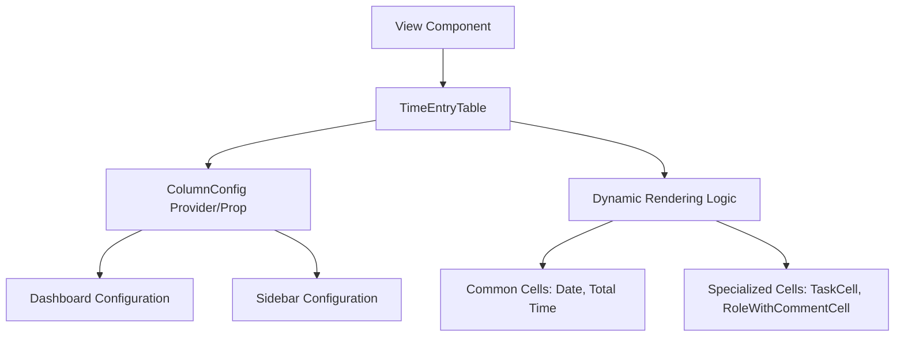

# Scalable UI Architecture for Time Entry Table

## Overview

This plan outlines the implementation of a flexible, configuration-driven `TimeEntryTable` component that supports both a Comprehensive Dashboard view and a Condensed Sidebar view.

## 1. Core Architecture: Configuration Over Duplication

Instead of creating two separate table components or using numerous conditional props, we will implement a "Headless" or "Configurable" Table pattern.

### 1.1 Column Definitions (`ColumnDef`)

We will define an interface for columns that allows us to specify:

- **Header**: How the column header should look (can be a string or a component).
- **Cell**: How each cell in the column should render the data.
- **Styling**: Width, alignment, and visibility.

### 1.2 View Configurations

We will define two static configurations:

- `DASHBOARD_COLUMNS`: Full set of columns as requested.
- `SIDEBAR_COLUMNS`: Streamlined set of columns with combined data fields.

## 2. Component Structure

### 2.1 Reusable Cell Components

To maintain clean code, specific cell logic will be extracted into small, focused components:

- `TaskCell`: Dashboard view. Shows task name and the row menu.
- `RoleCell`: Standard role display.
- `CommentCell`:
  - Dashboard: Full text display.
  - Sidebar: Tooltip icon if a comment exists.
- `TimeRangeCell`:
  - Dashboard: Separate Start and End columns.
  - Sidebar: Combined string (e.g., "09:00 - 10:30").

### 2.2 Table Composition

The main `TimeEntryTable` will iterate over the provided `ColumnDef` array to render headers and rows dynamically.

## 3. Data Flow & maintainability

- **Type Safety**: Use TypeScript generics to ensure column accessors are valid.
- **Theming**: Leverage Mantine's `Table` component for consistent styling.
- **Flexibility**: New views can be added by simply defining a new column configuration array.

## 4. Requirement Mapping

| Feature | Dashboard View | Sidebar View |
| :--- | :--- | :--- |
| **Columns** | 9 (Checkbox, Task, Role, Board, etc.) | 5 (Total, Role/Comment, Date, Range, Menu) |
| **Menu** | Inline with Task name | Separate last column |
| **Comments** | Full column | Tooltip icon in Role column |
| **Time** | Start & End columns | Combined string |

## 5. Mermaid Diagram

## 6. Next Steps

1. Define shared types.
2. Implement cell components.
3. Refactor `TimeEntryTable` to be configuration-driven.
4. Update consumers.
